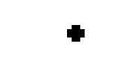
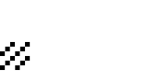
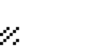
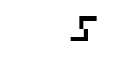
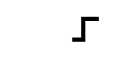
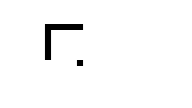
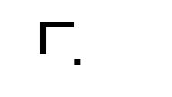

# Spatial patterns for "25% of 416x416 px" threshold
All source images in this folder are patterns for testing the following area threshold:
> Fail where 25% or more of the pixels are involved from any 416 x 416 px subarea

Filenames that start with 'f' are failing (i.e., more pixels than the threshold). 
Those starting with 'a' pass the area threshold.

For any failing spatial pattern incorporated into a video, 
all of the other thresholds also need to fail for a video sequence to be 
considered potentially hazardous.

| File | Description | *f* - Fail area threshold | *a* - Pass area threshold |
| --- | --- | --- | --- |
| *x*001 ... | Single contiguous shape near the middle |  |  |
| *x*002 ... | Single contiguous shape near the corner |  |  |
| *x*003 ... | Hollow shape |  |  |
| *x*004 ... | Parallel bars within a 416x416 frame |  |  |
| *x*005 ... | Two contiguous shapes within a 416x416 frame |  |  |
| *x*006 ... | Diffuse pattern within a 416x416 frame |  |  |
| *x*007 ... | Diagonal pattern within a 416x416 frame |  |  |
| *x*008 ... | Corner brackets within a 416x416 frame |  |  |
| *x*009 ... | Roughly S-shaped figure |  |  |
| *x*010 ... | Parallel bars inside or outside of the frame |  |  |
| *x*011 ... | Shape with an additional dot inside or outside of the frame |  |  |
| *x*012 ... | Broader shape with an additional dot inside or outside of the frame |  |  |
