# Luminance flash patterns for 0.1 relative luminance and >3 flashes/s thresholds
All source CSV files in this folder are patterns for testing the luminance flash thresholds:
> - luminance threshold of 0.1 relative luminance (RL)
> - flash count threshold of >3 flashes per second (i.e., 7 or more alternating transitions)

Filenames that start with 
 - 'f' are failing - fail luminance threshold (0.1 RL) and fail count threshold (>3 flash/s)
 - 'c' are passing - fail luminance threshold (0.1 RL) and pass count threshold (>3 flash/s)
 - 'l' are passing - pass luminance threshold (0.1 RL) and fail count threshold (>3 flash/s)
 - 'y' are passing - pass luminance threshold with only one flash in the sequence below threshold (0.1 RL) and fail count threshold (>3 flash/s)

For any failing pattern incorporated into a video, 
all of the other thresholds also need to fail for a video sequence to be 
considered potentially hazardous.

Note that many of the flashes marked 'f' in this folder would pass the NAB-J standards.

## Patterns
Representations of temporal-color patterns.

### 30 fps tests

| Scheme | Description | *f* - Failure | *l* - Lum. Pass | *c* - Flash Count Pass | *y* - Single Lum. Pass |
| --- | --- | --- | --- | --- | --- |
| *x*00*n*_ srgba. csv | 6 or 7 quick transitions right away | 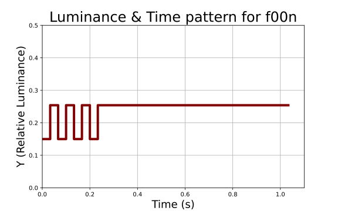 | 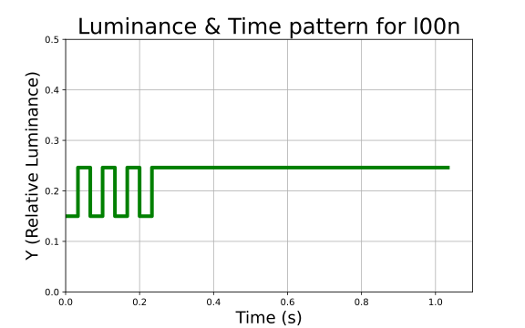 | 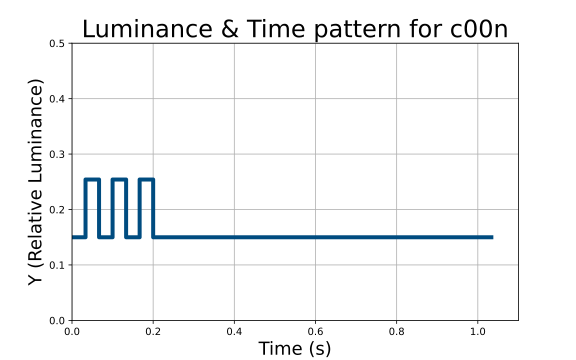 | 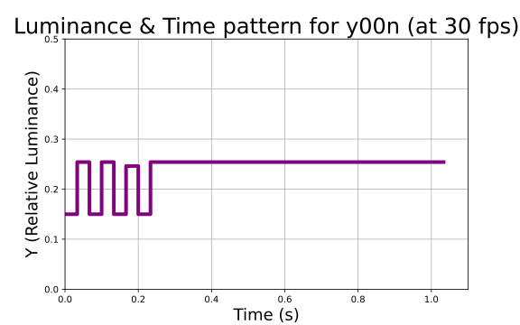 | 
| *x*r00*n*_ srgba. csv | 6 or 7 quick transitions right away (reversed polarity) | 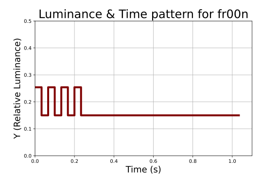 | 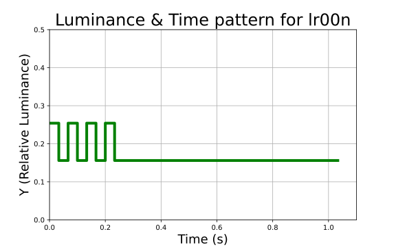 | 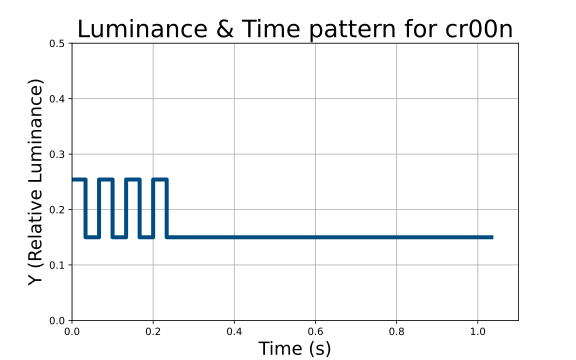 | N/A | 
| *x*01*n*_ srgba. csv | Evenly spaced quick flashes | 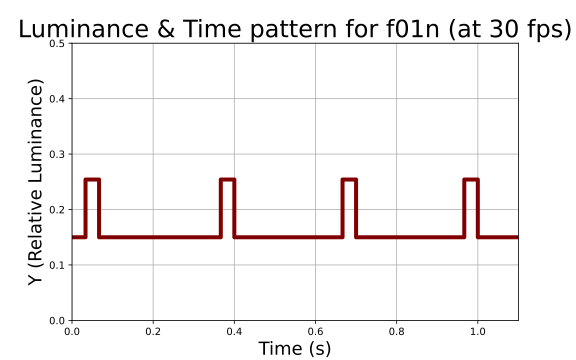 | 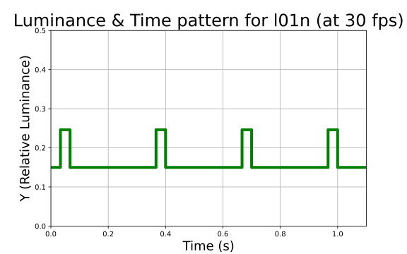 | 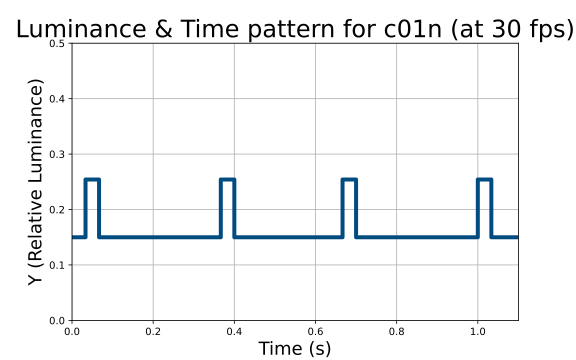 | 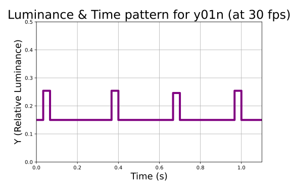 | 
| *x*r01*n*_ srgba. csv | Evenly spaced quick flashes (reversed polarity) | 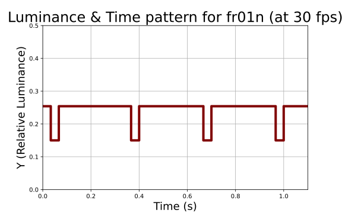 | 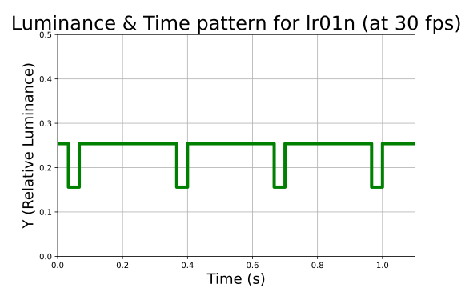 | 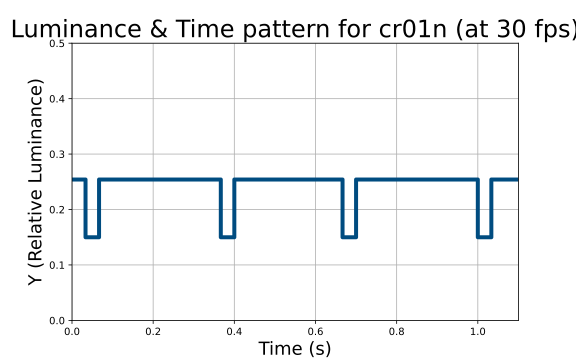 | N/A | 
| *x*02*n*_ srgba. csv | Square wave (nearly so) | 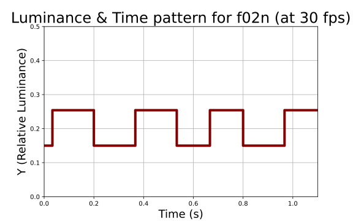 | 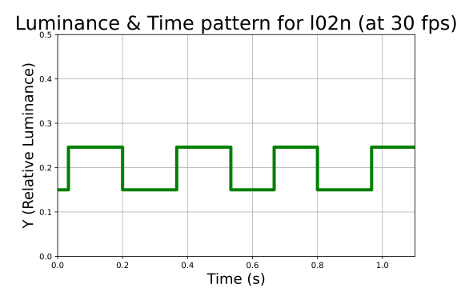 | 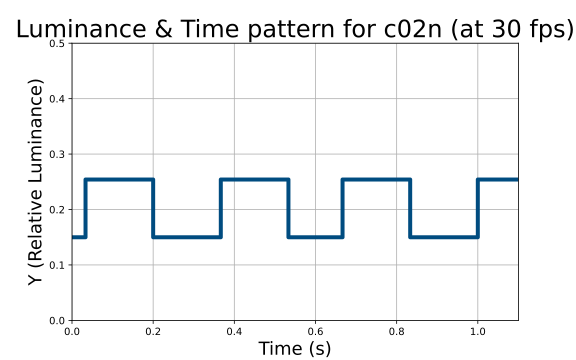 | 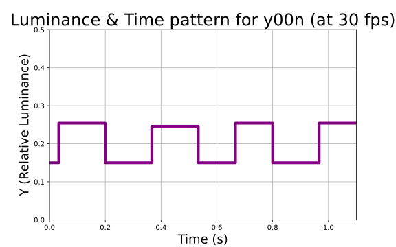 | 
| *x*03*n*_ srgba. csv | Various multi-step flashes where each step does/doesn't exceed luminance threshold (checks if alternating transitions are being counted properly) | 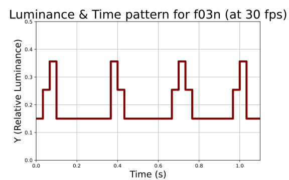 | 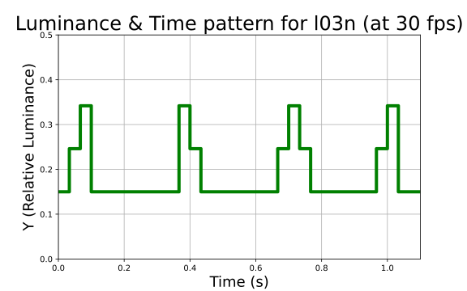 | 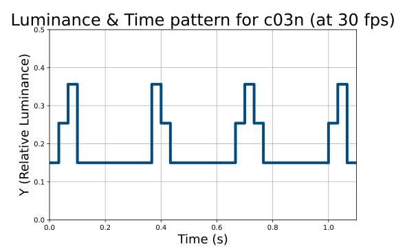 | 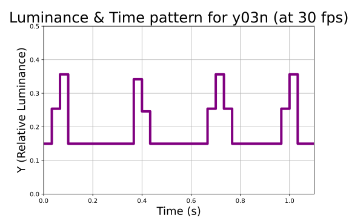 | 
